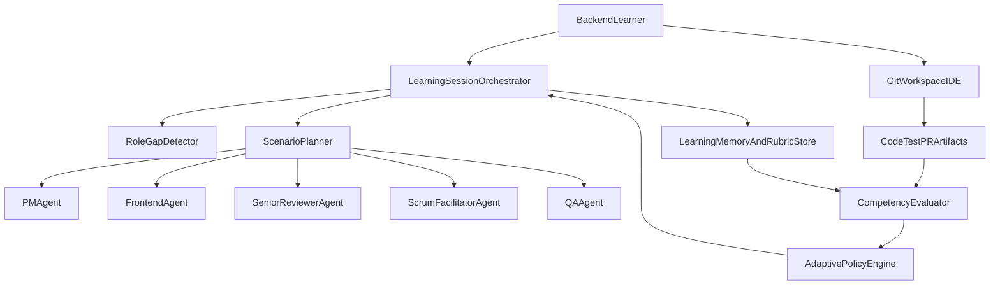
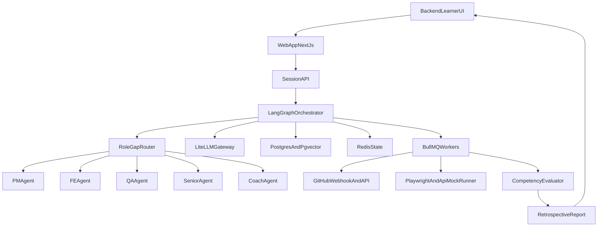

# 사용자 시나리오 중심 AI 협업 에이전트 아키텍처 (실구동 기준)

## 1) 목표와 설계 원칙

- **핵심 목표**: 역할 편중을 줄이고, 학습자가 실제 팀처럼 기획-설계-개발-리뷰-배포 커뮤니케이션을 반복 경험하도록 한다.
- **원칙**
  - 역할 대체가 아니라 **역할 학습 촉진**(사용자가 주도, AI는 협업 파트너).
  - 자동완성 중심이 아니라 **실무 의사결정 로그**(왜 이 선택을 했는지 기록).
  - 난이도는 고정이 아닌 **적응형**을 기본으로 하되, 학습 목표에 맞게 상/중/하 모드 잠금 가능.

## 2) 사용자 페르소나 기준 대표 시나리오

- **주 사용자**: 백엔드 학습자 1인.
- **경험 목표**: PM 요구사항 협의, 프론트와 API 계약, 동료 코드리뷰, 시니어 컨펌, 스프린트 회고까지 전 과정 체험.

### 시나리오 A: PM/프론트 모두 없음 (1인 학습)

- PM 에이전트가 요구사항/우선순위 제시.
- FE 에이전트가 화면/상태/에러케이스 관점에서 API 협의.
- Design 에이전트가 사용자 흐름/와이어프레임/UX 제약 제시.
- BE 학습자는 설계-구현-테스트 수행.
- Senior 에이전트가 설계 리뷰 + PR 승인/반려 피드백.
- QA 에이전트가 엣지케이스/회귀 위험 점검.
- Coordinator 에이전트가 회의 진행/충돌 조정/역할 편중 경보를 담당.

### 시나리오 B: PM만 있음, 프론트 없음

- 실PM(사람)+FE 에이전트 조합으로 API 계약 명확화.
- Design/QA 에이전트가 구현 리스크와 사용자 흐름 결손을 보완.
- BE 학습자는 PM 의도 해석 → FE 요구 반영 → 백엔드 설계.

### 시나리오 C: 프론트만 있음, PM 없음

- PM 에이전트가 목표/범위/성공지표 정의를 보완.
- BE/Design/QA 에이전트가 제약조건과 검증 관점을 병렬 제시.
- 사람 FE와 BE 학습자가 인터페이스 협업.

### 시나리오 D: 일부 역할만 사람, 나머지 AI

- 빈 역할만 AI가 대체.
- 사람이 맡은 역할에는 AI가 **코파일럿 모드**로 들어가 보조.

### 시나리오 E: FE + 디자인만 있는 경우

- PM/BE 에이전트가 일정·백엔드 제약·데이터 계약을 명시.
- QA 에이전트가 접근성/예외흐름 검증 항목을 추가.
- 현실 제약(일정 불가, API 선계약 필요, 접근성 이슈)을 명시적으로 주입.

## 3) 질문하신 4가지 의사결정에 대한 권장안

### (1) 역할 조합 모든 경우 대응

- **권장**: `Role Gap Detector`로 팀 구성 입력 시 누락 역할 자동 감지.
- 누락 역할별로 에이전트를 동적으로 활성화:
  - PM 누락 → PM 에이전트 활성화
  - FE 누락 → FE 에이전트 활성화
  - 둘 다 누락 → 둘 다 활성화
- 과부하 감지(한 사람에게 업무 집중) 시 협업 태스크를 재분배.

### (2) 처음 주제는 있어야 하나?

- **권장 기본값: “주제 없이 시작 가능” + 시작 즉시 주제 생성**
- 모드 1(입력형): 사용자가 주제를 직접 제공.
- 모드 2(생성형): PM 에이전트가 역할 조합/학습 목표 기반으로 주제 후보 3~4개를 제시하고 선택.
- 이유: 학습 목적은 주제 자체보다 협업 과정 체험이므로, 주제 부재가 시작 장벽이 되면 안 됨.

### (3) 에이전트 수준 고정 vs 사용자 적응형

- **권장: 적응형 + 가드레일(혼합형)**
  - 적응형: 사용자 숙련도/최근 성과에 따라 힌트 강도 조절.
  - 가드레일: 과도한 자동코드 생성을 제한하고 설명/질문을 먼저 유도.
- 레벨 정책 예시:
  - Beginner: 체크리스트 + 단계별 힌트
  - Intermediate: 의사결정 비교, 부분 힌트
  - Advanced: 리뷰 중심, 구현 자율성 최대

### (4) 채팅 vs 음성 회의

- **1단계(MVP)**: 채팅 기반으로 시작 (재현성/로그 분석/평가 용이).
- **2단계**: 음성 회의 모드 추가 (실무 커뮤니케이션 훈련 강화).
- 결론: 역량 훈련 자체는 채팅만으로도 가능하나, 회의 스킬(발화/조율)까지 목표면 음성 모드가 필요.

## 4) 실제 사용 아키텍처 (MVP → 확장)




### 핵심 컴포넌트

- `LearningSessionOrchestrator`: 전체 세션 상태/턴 관리.
- `RoleGapDetector`: 사람 역할 분포를 보고 AI 역할 자동 주입.
- `ScenarioPlanner`: 스프린트 목표/업무 분해/회의 아젠다 생성.
- `Role Agents`(PM/FE/BE/Design/QA/Senior/Coordinator): 역할별 관점으로 질문/요구/피드백 제공.
- `Coach Agent`(분리 운영): 팀원 역할과 분리된 학습 해설/용어 코칭 담당.
- `CompetencyEvaluator`: 협업지표(요구사항 명확성, API 협의 품질, 리뷰 반영률 등) 평가.
- `AdaptivePolicyEngine`: 다음 턴 힌트 강도/난이도 조절.
- `LearningMemory`: 학습자 약점/개선 추세/결정 로그 저장.

## 5) 사용자 여정(백엔드 1인 기준)

1. 온보딩: 목표 선택(예: “API 협업 역량 강화”), 현재 수준 자가진단.
2. 주제 선정: seed topic 선택 또는 PM 에이전트 제안.
3. 킥오프 회의: PM/FE 에이전트와 요구사항/스코프 합의.
4. 설계 단계: API 스펙/ERD/예외처리 정의, Senior 사전 코멘트.
5. 구현 단계: BE 개발 + FE 에이전트 계약 검증 + QA 테스트케이스.
6. 리뷰 단계: PR 생성, Senior 에이전트의 실무형 코멘트 반영.
7. 회고 단계: 협업 로그 기반 개인 피드백과 다음 스프린트 목표 추천.

## 6) 병렬 작업 전략 (실무 유사성 강화)

- PM/FE/QA 에이전트가 같은 티켓을 각 관점에서 동시에 검토.
- Orchestrator가 충돌 코멘트를 정리해 **결정이 필요한 이슈만** 사용자에게 제시.
- Senior 에이전트는 최종 승인 게이트 역할 수행.
- Coordinator 에이전트가 회의 순서/발화 균형/업무 편중 경보를 운영.

## 7) 평가 지표(KPI) 설계

- 역할 균형 지표: 역할별 발화/의사결정/작업 비중.
- 협업 품질 지표: API 계약 변경 횟수, 요구사항 재작업률, 리뷰 반영률.
- 학습 성과 지표: 독립 구현 비율, 문제 해결 시간 단축, 회고 개선률.
- 공정성 지표: 특정 역할 과부하 빈도, 업무 편중 경보 횟수.

## 8) MVP 범위 제안 (8~10주)

- 채팅 기반 멀티에이전트 + Git 연동 + PR 리뷰 시뮬레이션 + 회고 리포트.
- 음성, 실시간 다중인원 동시 접속, 고급 분석 대시보드는 2단계로 분리.

## 9) 리스크와 완화

- AI가 과도하게 정답을 주는 문제 → 힌트 지연/질문 우선 정책.
- 역할 고정관념 강화 위험 → 역할 로테이션 미션 추가.
- 평가 신뢰도 부족 → 자동지표 + 자기평가 + 멘토평가 혼합.

## 10) 구현 우선순위

- 1순위: Orchestrator + PM/FE/Senior 3에이전트 + 평가 최소셋.
- 2순위: QA/Scrum 에이전트, 적응형 난이도.
- 3순위: 음성 회의, 다중 학습자 실시간 협업.

## 11) 실제 구동 가능한 권장 기술 스택

- **앱 프레임워크**: `Next.js`(웹 UI + API 라우트) 또는 `NestJS`(백엔드 분리형) + `React`.
- **에이전트 오케스트레이션**: `LangGraph`(상태 기반 멀티에이전트 흐름 제어).
- **LLM 게이트웨이**: `LiteLLM`(모델 교체/비용 모니터링 용이).
- **DB**: `PostgreSQL`(세션/태스크/평가 로그) + `Redis`(실시간 세션/큐).
- **벡터 저장소**: 초기엔 `pgvector`(운영 단순화), 확장 시 전용 벡터 DB로 분리.
- **실시간**: `WebSocket`(채팅/회의 상태 브로드캐스트).
- **워크플로/잡 큐**: `BullMQ`(테스트 실행, 리뷰 분석, 리포트 생성 비동기 처리).
- **도구 연동**: `GitHub API`(PR/코멘트), `OpenAPI/Swagger` 파서, `Playwright`(FE/QA 모의검증).
- **관측성**: `OpenTelemetry` + `Grafana`(응답 지연, 에이전트 호출량, 실패율).

## 12) 왜 이 조합이 “최적”에 가까운가

- **학습제품 특성에 맞음**: 상태 전이가 많은 협업 시나리오에 LangGraph가 적합.
- **MVP 속도**: Next.js + Postgres로 단일 리포에서 빠르게 구현 가능.
- **운영 난이도 낮음**: pgvector/Redis/BullMQ 조합은 소규모 팀이 유지보수하기 좋음.
- **확장 경로 명확**: 사용자 증가 시 API/Agent Runtime/Worker를 수평 분리 가능.
- **비용 통제 가능**: LiteLLM을 통해 모델별 라우팅과 토큰 정책을 중앙 제어 가능.

## 13) 실사용 아키텍처 (배포 관점)




## 14) 백엔드 학습자 1인 기준 “1주 시뮬레이션” 운영 스크립트

- **Day1 (킥오프)**: PM/FE 에이전트와 요구사항 정리, 스코프/완료기준 합의.
- **Day2 (설계)**: API 계약(OpenAPI), ERD, 예외 응답 규격 확정.
- **Day3-4 (구현)**: 백엔드 구현, FE/QA 에이전트가 병렬로 계약 위반/에러케이스 리포트.
- **Day5 (리뷰)**: Senior 에이전트 PR 리뷰, 성능/확장성/N+1/보안 피드백 반영.
- **Day6 (검증)**: QA 시나리오 통과, PM 승인 체크리스트 완료.
- **Day7 (회고)**: 협업 점수/역할편중/커뮤니케이션 품질 리포트 + 다음 목표 추천.

## 15) 에이전트 정책(학습 효과 보장)

- **역할 고정**: 각 에이전트는 자기 책임 범위를 넘지 않음.
- **정답 직제공 제한**: Senior/Coach는 질문 우선, 직접 정답코드 제공 최소화.
- **난이도 적응**: 초급은 힌트 강화, 중급은 선택지 비교, 고급은 리뷰 강도 강화.
- **실수 시뮬레이션**: FE/QA 에이전트가 현실적인 오해/요구 변경을 가끔 유발.
- **증거 기반 피드백**: 모든 피드백은 로그/코드/테스트 결과와 연결.
- **코치 분리 원칙**: Coach는 팀 의사결정에 개입하지 않고 세션 후 해설 중심으로만 동작.

## 16) MVP 기능 명세 (첫 배포 필수)

- 멀티에이전트 채팅 채널(역할별 분리).
- 스프린트 생성/업무 분해/상태 전환 보드.
- GitHub PR 감지 + Senior 리뷰 코멘트 생성.
- OpenAPI 계약 검증 + QA 테스트 리포트.
- 회고 리포트(협업지표 4종: 역할균형, 재작업률, 리뷰반영률, 커뮤니케이션 품질).

## 17) 12주 구현 로드맵

- **1-2주**: 도메인 모델/세션 상태머신/역할 결손 탐지 규칙.
- **3-4주**: PM/FE/Senior 3개 에이전트 + 채팅 UI.
- **5-6주**: OpenAPI 검증, QA 자동체크, GitHub webhook 연동.
- **7-8주**: 평가 엔진 + 회고 리포트 + 난이도 적응 정책.
- **9-10주**: 파일럿(10~30명), 로그 기반 프롬프트 튜닝.
- **11-12주**: 안정화, 운영 대시보드, 교육기관 도입 문서화.

## 18) 성공 기준 (파일럿 합격선)

- 세션 완료율 70% 이상.
- 역할 편중 경보 빈도 30% 이상 감소.
- 리뷰 코멘트 반영률 60% 이상.
- 학습자 자기평가에서 “실무 협업 체감” 평균 4.0/5 이상.

## 19) 다음 단계

- 이 계획으로 시작하면 **채팅 기반 MVP를 먼저 출시**하고, 이후 음성 회의/실시간 다인 협업을 확장하는 전략이 가장 현실적이다.
- 첫 배포 타깃은 “백엔드 1인 학습자”로 고정하고, PM만/FE만 케이스는 2차 파일럿에서 확장한다.

## 20) 대화 방식 재정의 (자연어 + 코드/문서/Git 결합)

- 이 제품의 협업 인터페이스는 `자연어 채팅 단독`이 아니라 `채팅 + 코드 diff + API 명세 + PR 리뷰` 결합형으로 정의한다.
- “로그인 페이지 짜줘” 같은 모호 요청은 바로 실행하지 않고, PM/FE 에이전트가 요구사항 템플릿(입력/출력/에러/수용기준)으로 재질문한다.
- 대화의 결과는 항상 산출물에 매핑한다: 이슈 카드, OpenAPI 변경, PR 코멘트, 테스트 결과, 회의록.
- 교육 목표상 핵심은 자동완성이 아니라 `조율-리뷰-재작업-합의` 루프 경험이다.

## 21) 백엔드 학습자-프론트 에이전트 협업 표준 프로세스

1. 요구사항/계약 합의: API 계약(OpenAPI)과 FE 요구(화면/상태/예외)를 먼저 잠근다.
2. 병렬 구현: BE는 서버 구현, FE 에이전트는 명세 기반 뷰/호출 로직 생성.
3. PR 기반 피드백: 학습자가 PR 코멘트로 수정 지시, 에이전트 재커밋.
4. 통합/검증: QA 에이전트가 계약 테스트/회귀 테스트 실행.
5. 승인/회고: Senior 승인 후 머지, 협업지표 리포트로 회고.

## 22) 현실 이슈 정의와 필수 대응정책

### 이슈 1) 컨텍스트 한계 (기억 손실)

- **증상**: 과거 합의(코딩컨벤션/디자인토큰/API 규칙)를 잊고 불일치 코드 생성.
- **대응**
  - 세션 시작 시 `ProjectContract` 스냅샷 자동 주입(코딩규칙, API 규약, UI 규칙).
  - 긴 대화는 요약 메모리(`RollingSummary`)로 압축 저장.
  - PR 생성 전 `규약 준수 체크리스트` 자동 검증.

### 이슈 2) 환각/명세 불일치

- **증상**: 존재하지 않는 엔드포인트 호출, 임의 필드 사용.
- **대응**
  - FE/QA 에이전트 출력은 반드시 OpenAPI 스키마 검증 통과 후에만 PR 가능.
  - 타입 생성기(OpenAPI -> 타입) 기반 컴파일 게이트 적용.
  - 계약 불일치 시 자동 수정 대신 `차이 리포트`를 사용자 승인 후 반영.

### 이슈 3) 모호한 지시 처리 실패

- **증상**: “깔끔하게” 같은 추상 지시를 잘못 해석해 재작업 증가.
- **대응**
  - `Prompt-to-Spec` 단계 강제: 자연어를 수용기준(DoD)으로 변환 후 실행.
  - 초급자용 지시 템플릿(목표/범위/금지사항/완료조건) 제공.
  - Coach 에이전트가 피드백 문장 교정(실무형 리뷰 문장 추천).

### 이슈 4) 변경 충돌/동기화 실패

- **증상**: API 응답 구조 변경 후 FE 코드 대량 충돌.
- **대응**
  - API 버전 태깅(`v1`, `v1.1`)과 deprecation 기간 정책 도입.
  - 변경 탐지 시 영향 범위(엔드포인트/컴포넌트/테스트) 자동 그래프 생성.
  - 충돌 수정은 자동 머지보다 `수정 제안 PR` 방식으로 안전하게 처리.

### 이슈 5) 무한 루프/운영비 폭증

- **증상**: 빌드 실패-재시도 반복으로 토큰/시간 급증.
- **대응**
  - 에이전트별 `최대 반복 횟수`와 `시간/토큰 예산` 하드리밋 설정.
  - 3회 실패 시 자동 중단 후 원인요약 + 사용자 의사결정 요청.
  - 비싼 모델은 리뷰/승인 단계에만 사용하고 구현 단계는 저비용 모델 라우팅.

## 23) 대화 창구 전략 (외부 메신저 vs 자체 워크스페이스)

- **MVP 권장**: 자체 웹 워크스페이스(채팅 + 보드 + PR/명세 뷰) 우선.
- 이유
  - 교육 로그/평가/KPI를 한 화면에서 수집 가능.
  - 메시지와 코드산출물의 추적성(Traceability) 확보가 쉬움.
  - 외부 메신저 의존도를 줄여 권한/보안/데이터 파편화 문제 완화.
- **2단계 확장**: Slack/Discord 연동은 알림/요약 브리지로 제한하고, 의사결정 원본은 내부 시스템에 기록.

## 24) MVP에 추가할 필수 기능 (문제 대응 관점)

- 계약 검증 게이트(OpenAPI 일치 여부) 없으면 PR 생성 불가.
- 루프 가드(재시도 횟수, 토큰 예산, 강제 중단) 대시보드.
- 모호 지시 교정기(Prompt-to-Spec 변환 패널).
- 변경 영향도 리포트(API 변경 시 FE/QA 영향 목록 자동 생성).
- 세션 컨텍스트 패키지(ProjectContract + 최근 합의 + 미해결 이슈) 자동 주입.

## 25) Sprint 1 실행 백로그 (2주)

### 목표

- 백엔드 1인 학습자가 PM/FE/Senior와 채팅 기반 협업 루프를 1회 완주할 수 있는 최소 제품을 만든다.
- 산출물 추적(대화 -> 이슈 -> PR 피드백 -> 회고 요약)이 끊기지 않도록 한다.

### 스토리 1: 역할 결손 탐지와 에이전트 주입

- **유저 스토리**: 백엔드 학습자로 시작하면 부족한 역할(PM, FE, Senior)이 자동으로 활성화되길 원한다.
- **수용 기준(AC)**
  - 세션 시작 시 사용자 역할 입력값으로 결손 역할이 계산된다.
  - 결손 역할에 대응하는 에이전트가 채팅 채널에 자동 참여한다.
  - 사람 역할이 나중에 추가되면 동일 AI 역할은 코파일럿 모드로 전환된다.

### 스토리 2: Prompt-to-Spec 변환

- **유저 스토리**: 모호한 지시를 구체적 수용기준으로 바꿔서 재작업을 줄이고 싶다.
- **수용 기준(AC)**
  - 사용자가 자연어 요청을 입력하면 목표/범위/금지사항/완료조건 템플릿으로 변환된다.
  - 변환 결과를 승인해야 구현 단계로 넘어간다.
  - 승인된 스펙은 세션 메모리에 저장되고 이후 에이전트 응답에 주입된다.

### 스토리 3: PR 피드백 루프(시뮬레이션)

- **유저 스토리**: Senior/FE 에이전트의 실무형 피드백을 받고 수정-재검토 루프를 경험하고 싶다.
- **수용 기준(AC)**
  - 학습자가 “PR 제출” 이벤트를 실행하면 Senior/FE 에이전트 리뷰 코멘트가 생성된다.
  - 학습자가 코멘트 반영 체크를 하면 “반영됨/보류됨/추가설명필요”로 상태 전환된다.
  - 최소 1회 수정 후 재검토 단계를 거쳐야 최종 승인 가능하다.

### 스토리 4: 계약 검증 게이트(기본형)

- **유저 스토리**: 존재하지 않는 API 호출이나 필드 환각을 사전에 막고 싶다.
- **수용 기준(AC)**
  - OpenAPI 문서 업로드 또는 입력이 가능하다.
  - FE 에이전트가 제안한 요청/응답 필드가 스키마와 불일치하면 경고를 출력한다.
  - 불일치 상태에서는 “최종 승인” 버튼이 비활성화된다.

### 스토리 5: 회고 리포트(기초 KPI 4종)

- **유저 스토리**: 세션 종료 후 협업 역량 관점에서 무엇을 개선할지 알고 싶다.
- **수용 기준(AC)**
  - 세션 종료 시 역할균형/재작업률/리뷰반영률/커뮤니케이션 품질 점수를 생성한다.
  - 점수와 함께 다음 스프린트 행동 제안 3개를 제공한다.
  - 리포트는 세션 기록으로 저장되어 비교 조회 가능하다.

### 완료 정의(Definition of Done)

- 백엔드 1인 기준 데모 시나리오 1개를 처음부터 끝까지 재현 가능.
- 치명 오류 없이 30분 이상 세션 진행 가능.
- 핵심 이벤트 로그(시작/스펙승인/PR제출/리뷰반영/회고생성)가 누락 없이 저장.

### 제외 범위(Out of Scope)

- 음성 회의 인터페이스.
- 실 GitHub 자동 푸시/머지.
- 다중 학습자 동시 실시간 세션.

## 26) 잠재 리스크 검토 결과 (채택)

- 제안한 리스크는 모두 타당하며, 현 아키텍처에 반드시 반영해야 한다.
- 특히 `응답 지연`, `초보자 온보딩 장벽`, `평가 신뢰도`, `롤백 부재`, `MVP 오버엔지니어링`은 출시 실패를 유발하는 상위 위험군이다.
- 아래 27~31항에 각 리스크별 설계 대응을 고정 정책으로 추가한다.

## 27) 리스크 레지스터 (우선순위/대응)

### R1. 멀티 에이전트 지연(Latency)로 인한 이탈

- **위험**: 10초~60초 대기 시 사용자가 멈춤으로 인식.
- **정책**
  - Thought Stream UI(노드 상태 중계) 필수.
  - 빠른 즉시응답(ACK) + 비동기 완료 푸시(WebSocket) 기본.
  - 타임아웃 단계별 가시화(분석 중/검증 중/리뷰 중).

### R2. OpenAPI 온보딩 장벽

- **위험**: 초급 학습자가 스펙 입력 단계에서 이탈.
- **정책**
  - Wizard 기반 `Spec Extractor` 기본 탑재.
  - 채팅 입력 -> OpenAPI 초안 자동 생성 -> 사용자 승인/수정 구조.
  - Day2 설계는 고정 일정이 아니라 사용자 정의 스프린트에 따라 유연 배치.

### R3. 평가 엔진 신뢰도 논란

- **위험**: LLM 주관성으로 점수 불신 발생.
- **정책**
  - 점수는 Rule-based 로그 지표만 사용.
  - LLM 평가는 서술형 코멘트로 제한.
  - 각 점수 항목에 근거 이벤트(로그 링크/횟수) 노출.

### R4. 상태 오염과 롤백 부재

- **위험**: 잘못 승인된 스펙으로 에이전트 폭주, 재작업 누적.
- **정책**
  - 마일스톤 체크포인트 저장(스펙 승인/PR 제출/리뷰 승인).
  - UI Undo/Rollback 버튼 제공(특정 스냅샷 복원).
  - 롤백 시 미해결 충돌 자동 목록화 후 재확인.

### R5. MVP 범위 과대(Playwright 동적 검증)

- **위험**: 8~10주 MVP에서 샌드박스+브라우저 자동화는 과도한 범위.
- **정책**
  - MVP는 정적 검증 중심(TypeScript/ESLint/OpenAPI Validator).
  - 동적 E2E(Playwright)는 V2로 이관.
  - 목표는 “계약 기반 협업 경험” 달성에 집중.

## 28) 고도화 아키텍처 전략 채택안

### 전략 A: 이벤트 기반 비동기 오케스트레이션(EDA)

- 모든 에이전트 활동을 Event로 표준화(`SPEC_APPROVED`, `PR_REVIEW_REQUESTED`, `QA_FAILED`).
- 요청 즉시 ACK 후 결과는 WebSocket으로 푸시.
- 이벤트 타임라인을 회고/평가 데이터로 재사용.

### 전략 B: Shadow Git + VFS 보호계층

- AI는 사용자 메인 작업공간에 직접 쓰지 않음.
- Shadow Branch/VFS에서 변경을 생성하고 Diff로 제시.
- 사용자 승인 시에만 반영(학습자 코드 보호 우선).

### 전략 C: Supervisor 중심 계층형 제어

- Supervisor가 작업 분배/충돌 조정/품질 게이트 담당.
- Worker(PM/FE/QA/Senior)는 할당 작업만 수행.
- Review Gate에서 승인/재작업/질문 분기 처리.

## 29) 컨텍스트/경합/외부장애 대응 강화

### 29-1. 컨텍스트 드리프트 방지 (3계층 메모리)

- Short-term: 현재 세션 상태.
- Long-term: 과거 결정사항 RAG 조회.
- Immutable Contract: 프로젝트 헌장 고정 주입(최상단 시스템 컨텍스트).

### 29-2. 경합 조건(Race Condition) 대응

- State Versioning(시퀀스 번호) 적용.
- 쓰기 작업 중 잠금 또는 읽기 전용 전환.
- 오래된 버전 기반 리뷰 결과는 자동 무효화/재검토 요청.

### 29-3. 외부 LLM 장애 대응(Resilience)

- Circuit Breaker: 연속 실패/지연 시 해당 에이전트 일시정지.
- Fallback Model: 고성능 모델 실패 시 경량 모델로 자동 전환.
- 사용자 안내 메시지를 페르소나 톤으로 제공해 흐름 유지.

## 30) 3-Layer Defense 반영

### Layer 1. 비동기 메시지 버스(Pub/Sub)

- Redis Streams 또는 RabbitMQ 기반 이벤트 큐.
- 장시간 작업/재시도/실패 복구를 메시지 단위로 관리.

### Layer 2. 샌드박스 파일계층(VFS)

- 중간 산출물은 DB 기반 VFS에 저장.
- 반영 전까지 원본 파일 무변경 보장.
- 롤백/비교/재시도에 유리한 상태 구조 확보.

### Layer 3. 옵저버빌리티 대시보드

- 에이전트별 지연/성공률/토큰비용/재시도 횟수 추적.
- 병목 구간과 과금 급증 구간을 실시간 탐지.
- 운영 임계치(예: 지연 15초, 실패율 5%) 초과 시 경보.

## 31) MVP 조정안 (다운사이징 확정)

- **포함**
  - 채팅 기반 협업
  - Prompt-to-Spec Wizard
  - 계약 검증(OpenAPI + 정적 타입/린트)
  - PR 리뷰 시뮬레이션
  - Rule-based 평가 + LLM 코멘트
  - 체크포인트/롤백
- **제외(V2 이관)**
  - Playwright 기반 동적 UI/E2E 검증
  - 실시간 음성 회의
  - 고급 다인 동시편집

## 32) 추가 위험 검토 반영 (일관성/교육/지연/인프라)

### 32-1. 컨텍스트 붕괴/에이전트 불협화음

- **위험 요약**: 역할별 에이전트가 서로 다른 “진실”을 말해 학습자가 중재자로 소모될 수 있음.
- **반영 정책**
  - `SSOT(ProjectState)`를 단일 진실원으로 강제.
  - 모든 에이전트 호출 시 SSOT 스냅샷을 시스템 컨텍스트 최상단에 주입.
  - 충돌 응답은 사용자에게 바로 노출하지 않고 Supervisor 검증 후 재작성.

### 32-2. 학습의 자동화 역설

- **위험 요약**: 너무 친절하면 복붙, 너무 추상적이면 좌절.
- **반영 정책**
  - 역할별 도움 한도(힌트 레벨) 정책화: 정답코드 직제공 제한.
  - “의사결정 강제 게이트” 도입: 핵심 선택(예: 인덱스, 에러정책)은 학습자 입력 없이는 다음 단계 불가.
  - Coach 피드백은 단계별(초급/중급/고급) 템플릿으로 일관성 유지.

### 32-3. 지연 시간으로 인한 몰입 저하

- **위험 요약**: 멀티 에이전트 합성 응답이 길어져 실시간성이 붕괴.
- **반영 정책**
  - 즉시 ACK + 비동기 결과 푸시 기본.
  - Thinking Stream(노드 진행상태) UI 의무화.
  - 턴당 활성 에이전트를 1~2개로 제한(기본), 필요 시만 병렬 확장.

### 32-4. Git/IDE 동기화 복잡성

- **위험 요약**: Shadow Git, 로컬 IDE, 웹 워크스페이스 동기화 충돌.
- **반영 정책**
  - MVP에서는 “완전 양방향 자동동기화”를 지원하지 않음(제한 명시).
  - 기본은 VFS/Shadow Branch에서 Diff 제안, 사용자가 수동 반영.
  - 실 Git 자동 병합/직접 푸시는 V2 이후 실험 기능으로 격리.

## 33) SSOT 중심 상태 모델 (강제 스키마)

- `ProjectState` 필수 필드
  - `approvedRequirements`
  - `currentApiSpecs`
  - `rejectedDecisions`
  - `openQuestions`
  - `activeSprintGoal`
  - `stateVersion`
- **규칙**
  - 에이전트 출력은 반드시 `stateVersion`을 참조.
  - 구버전 기반 답변은 폐기 후 재생성.
  - SSOT에 없는 주장은 “가설”로 표시하고 승인 요청 필요.

## 34) Supervisor 게이트키퍼 규칙

- 사용자 입력마다 Supervisor가 다음을 수행:
  - 어떤 에이전트를 호출할지 선택(최대 2개).
  - 응답이 SSOT와 충돌하는지 검증.
  - 충돌 시 “합의 필요 항목”만 요약하여 사용자에게 제시.
- **금지 규칙**
  - 모든 에이전트 동시 발화 금지(특수 디버그 모드 제외).
  - 검증 전 원문 응답 직출력 금지.

## 35) 가능/제한/제외 기능 명시 (현실성 선언)

### 가능 (MVP에서 구현)

- 채팅 기반 협업 시뮬레이션.
- SSOT 기반 일관성 관리.
- Supervisor 라우팅 및 충돌 요약.
- Prompt-to-Spec + 계약 검증(정적).
- 롤백(체크포인트 기준)과 회고 리포트.

### 제한 (MVP에서 부분 지원)

- IDE 연동: 읽기/요약 중심, 자동 반영은 제한.
- Git 연동: Diff 제안/PR 시뮬레이션 중심, 자동 머지 없음.
- 에이전트 병렬성: 제한 병렬(1~2개)만 허용.

### 제외 (V2 이후)

- 완전 자동 로컬 파일 동기화.
- 동적 런타임 E2E 브라우저 검증.
- 실시간 음성회의 및 다인 동시 협업 편집.

## 36) 실패 방지 운영 가드레일

- 에이전트 응답 지연 임계치 초과 시 경량 모드 자동 전환.
- 충돌이 3회 연속 발생하면 “합의 재수립 모드” 강제 진입.
- 학습자 개입이 없는 자동 수정 루프는 최대 2회로 제한.
- 핵심 단계(스펙 승인/리뷰 승인/머지 전)는 항상 사용자 명시적 승인 필요.

## 37) 권장 Repository 구조 (협업 시뮬레이터 기준)

```text
project-root/
├── docs/
│   ├── plan.md
│   ├── rules.md
│   ├── checklist.md
│   ├── notes.md
│   ├── project-contract.md
│   └── roles.md
├── agents/
│   ├── orchestrator/
│   │   ├── role-gap-detector-policy.md
│   │   ├── supervisor-policy.md
│   │   └── routing-rules.md
│   ├── pm-agent/
│   │   ├── pm-prompt.md
│   │   └── pm-policy.md
│   ├── fe-agent/
│   │   ├── fe-prompt.md
│   │   └── fe-policy.md
│   ├── backend-agent/
│   │   ├── be-prompt.md
│   │   └── be-policy.md
│   ├── qa-agent/
│   │   ├── qa-prompt.md
│   │   └── qa-policy.md
│   ├── senior-agent/
│   │   ├── senior-prompt.md
│   │   └── senior-policy.md
│   └── coach-agent/
│       ├── coach-prompt.md
│       └── coach-policy.md
├── specs/
│   ├── requirements.md
│   ├── openapi/
│   │   ├── v1.yaml
│   │   └── v1.1.yaml
│   ├── data-model/
│   │   ├── schema.md
│   │   └── types.ts
│   └── api-contract.md
├── src/
│   ├── backend/
│   │   ├── controllers/
│   │   ├── services/
│   │   ├── models/
│   │   └── middlewares/
│   └── frontend/
│       ├── app/
│       ├── components/
│       └── lib/
├── tests/
│   ├── unit/
│   ├── integration/
│   └── e2e/
├── scripts/
│   ├── validate-api-contract.js
│   └── prompt-to-spec.js
├── .ai/
│   ├── project-state.md
│   ├── checkpoints/
│   │   ├── sprint-start.md
│   │   ├── spec-approved.md
│   │   └── review-accepted.md
│   └── logs/
│       ├── orchestrator-logs.md
│       └── agent-logs.md
├── guides/
│   ├── how-to-use-ai.md
│   ├── how-to-coach.md
│   ├── how-to-orchestrate.md
│   └── how-to-debug-ai.md
└── .github/
    ├── workflows/
    └── PULL_REQUEST_TEMPLATE.md
```

## 38) 파일별 운영 규칙 (에이전트 컨텍스트 주입 순서)

### 공통 주입 순서 (매 턴)

1. `docs/plan.md` (스프린트 목표/범위/완료조건)
2. `docs/project-contract.md` + `.ai/project-state.md` (SSOT)
3. `docs/rules.md` (금지/품질/커뮤니케이션 규칙)
4. 역할별 `agents/*-policy.md` + `agents/*-prompt.md`
5. `specs/api-contract.md` + `specs/openapi/*.yaml`

### 핵심 파일 책임

- `docs/plan.md`: 이번 턴 작업이 스프린트 목표와 일치하는지 검증.
- `docs/rules.md`: 정답 직제공 제한, 승인 절차, 리뷰 톤 통일.
- `docs/checklist.md`: 단계 게이트(스펙 승인 -> 계약 검증 -> PR 반영 -> 회고).
- `docs/notes.md`: 도메인 맥락/예외 정책/실무 용어 기준.
- `docs/project-contract.md`: 변경 영향도 규칙과 승인 절차.
- `docs/roles.md`: 사람/AI 역할 매핑표와 권한 범위.

## 39) 에이전트 작업 프로토콜 (실행 형식 고정)

### FE Agent

- 입력: `plan.md`, `api-contract.md`, `openapi`, `notes.md`.
- 출력: UI/API 연동 제안 + 계약 불일치 리포트 + PR 코멘트 초안.
- 제한: 핵심 로직 완성 코드 직제공 금지, 제안은 Diff/코멘트 우선.

### BE Agent

- 입력: `requirements.md`, `openapi`, `project-state.md`.
- 출력: 설계 대안(2안 이상), 위험도, 구현 체크리스트.
- 제한: SSOT 미승인 요구 반영 금지.

### PM/QA/Senior/Coach

- PM: 스코프 관리, 우선순위, 결정 로그 기록.
- QA: 계약/정적검증 기준의 실패 케이스 생성.
- Senior: 리뷰 게이트(성능/확장성/리스크 질문 중심).
- Coach: 팀 의사결정 불개입, 세션 후 학습 해설만 수행.

## 40) 단계 게이트 (학습자 체감 협업 보장)

- Gate A: 요구사항 승인 (`docs/checklist.md` 업데이트 필요)
- Gate B: API 계약 승인 (`specs/api-contract.md` + `openapi` 버전 확정)
- Gate C: 구현/리뷰 (`PR 코멘트 반영 상태`가 기준)
- Gate D: 회고/평가 (`Rule-based KPI + 개선 액션 3개`)

## 41) 현실적 제한 명시 (불가능/제외/지연 허용)

- MVP에서 에이전트가 로컬 IDE 파일을 자동으로 완전 동기화하지 않는다.
- 실 Git 자동 머지/푸시는 제외하며, 승인형 Diff 반영만 지원한다.
- 에이전트 다중 병렬은 품질 저하를 막기 위해 기본 1~2개로 제한한다.
- 응답 지연은 완전 제거 불가하므로 Thought Stream으로 체감 지연을 완화한다.

## 42) 핵심 파일 템플릿 스켈레톤 (초안)

### 42-1) `docs/plan.md` 템플릿

```md
# Sprint Plan

## Goal
- 이번 스프린트의 학습 목표:
- 이번 스프린트의 기능 목표:

## Scope
- 포함:
- 제외:

## Definition of Done
- [ ] 요구사항 승인 완료
- [ ] API 계약 승인 완료
- [ ] PR 리뷰 반영 완료
- [ ] 회고 리포트 생성 완료

## Risks
- 예상 리스크:
- 완화 전략:
```

### 42-2) `docs/rules.md` 템플릿

```md
# Global Rules

## Collaboration Rules
- 정답 코드를 바로 제공하지 않는다.
- 제안은 선택지/질문/근거 중심으로 작성한다.
- SSOT와 충돌하는 주장 금지.

## Coding Rules
- API 스펙 변경 시 영향도 체크리스트 필수.
- 리뷰 코멘트는 재현 가능한 근거 포함.

## Communication Tone
- 실무 용어를 사용하되 초급자에게는 한 줄 설명을 붙인다.
```

### 42-3) `docs/checklist.md` 템플릿

```md
# Stage Checklist

## Gate A: Requirement
- [ ] 요구사항 확정
- [ ] 범위/우선순위 합의

## Gate B: API Contract
- [ ] OpenAPI v1 승인
- [ ] FE/QA 계약 검증 통과

## Gate C: Review
- [ ] PR 코멘트 반영
- [ ] 재검토 승인

## Gate D: Retrospective
- [ ] KPI 리포트 확인
- [ ] 다음 액션 3개 확정
```

### 42-4) `docs/project-contract.md` 템플릿

```md
# Project Contract

## Immutable Rules
- 모든 결정은 ProjectState에 기록한다.
- stateVersion 불일치 응답은 무효 처리한다.

## Change Policy
- API 계약 변경은 승인 절차를 거친다.
- 변경 영향도(엔드포인트/컴포넌트/테스트)를 먼저 제시한다.

## Approval Flow
1. 제안
2. 영향도 분석
3. 사용자 승인
4. 반영
```

### 42-5) `docs/roles.md` 템플릿

```md
# Role Mapping

## Human
- Learner: 구현/의사결정/승인

## AI
- PM: 요구사항/우선순위
- FE: API 소비 관점/연동 요구
- QA: 테스트/예외 케이스
- Senior: 아키텍처/리뷰 게이트
- Coach: 학습 해설 (의사결정 불개입)
- Supervisor: 라우팅/충돌 중재/최종 출력 조정
```

### 42-6) `agents/senior-agent/senior-policy.md` 템플릿

```md
# Senior Policy

## Must
- 위험(성능/확장성/보안)을 근거와 함께 지적한다.
- 정답코드 대신 질문 중심 피드백을 우선한다.

## Must Not
- 완성 코드를 통째로 제공하지 않는다.
- SSOT 미승인 요구를 승인하지 않는다.

## Review Output Format
- Finding:
- Why it matters:
- Suggested direction:
- Learner action:
```

### 42-7) `specs/api-contract.md` 템플릿

```md
# API Contract Summary

## Version
- current: v1

## Endpoints
- POST /auth/signup
- POST /auth/login
- GET /users/me

## Response Policy
- success format:
- error format:

## Change Log
- v1.1 candidate:
- impact:
- approval status:
```

### 42-8) `.ai/project-state.md` 템플릿

```md
# ProjectState (SSOT)

stateVersion: 1

approvedRequirements:
- ...

currentApiSpecs:
- openapi/v1.yaml

rejectedDecisions:
- ...

openQuestions:
- ...
```

## 43) Sprint 1 파일 생성 우선순위

1. `docs/plan.md`, `docs/rules.md`, `docs/project-contract.md`
2. `.ai/project-state.md`, `docs/checklist.md`, `docs/roles.md`
3. `specs/api-contract.md`, `specs/openapi/v1.yaml`
4. `agents/orchestrator/supervisor-policy.md`, `agents/senior-agent/senior-policy.md`
5. `guides/how-to-use-ai.md`

## 44) Token Pruning 전략 (비용/성능 최적화)

### 문제

- 세션 장기화 시 `SSOT`, `ProjectContract`, 대화 로그가 비대해져 토큰 비용 증가와 응답 품질 저하가 발생한다.

### 정책

- `ConsolidatedDecisions` 구조를 도입한다.
  - 원문 대화 로그 전체를 매 턴 주입하지 않는다.
  - 확정된 결론(승인 요구사항, 계약 변경, 보류 이슈)만 압축 보존한다.
- `LangGraph Checkpoint` + `SummaryAgent`를 결합한다.
  - N턴(예: 8~12턴)마다 요약 압축 수행.
  - 요약본은 SSOT의 `decisionDigest` 필드에 저장한다.
- 컨텍스트 주입 우선순위
  1. 최신 SSOT 핵심 필드
  2. ConsolidatedDecisions
  3. 현재 이슈 관련 원문 일부(필요 구간만)

### 수용 기준(AC)

- 동일 시나리오에서 평균 입력 토큰 30% 이상 절감.
- 압축 후에도 계약 위반 검출률 저하가 없어야 한다.

## 45) 시나리오 실현 가능성 진단: “BE 코드 작성 -> FE 자동 연계”

### 판단

- **가능**. 단, 코드 직접 해석보다 `계약(OpenAPI)`을 중심으로 연결해야 안정적이다.

### 필수 조건

- BE 결과물을 OpenAPI로 자동 노출 또는 추출:
  - Spring Boot: Swagger/OpenAPI 자동 생성 우선.
  - 미생성 시: `SpecExtractor`가 코드/주석 기반 초안 생성 후 사용자 승인.
- FE 에이전트는 코드 자체가 아니라 승인된 `openapi/*.yaml`을 기준으로 UI/API 바인딩을 수행.

### 게이트

- OpenAPI 미승인 상태에서는 FE 생성 작업을 제한 모드로 운영한다.
- 계약 승인 후에만 FE 자동 제안(컴포넌트/호출 코드) 활성화.

## 46) 고도화 권장안 (V2+)

### 46-1. Social Persona Simulation

- 역할 에이전트에 성향(Persona)을 부여한다.
  - 예: 엄격한 Senior, 급진적 PM, 신중한 FE.
- 목적: 기술적 합의뿐 아니라 설득/조율 커뮤니케이션 훈련 강화.
- 제한: 페르소나는 학습 방해를 막기 위해 강도 레벨(약/중/강)을 설정한다.

### 46-2. Incident Injection (Chaos Mode)

- `ScenarioPlanner`가 마일스톤 도달 시 확률적으로 Incident Event를 주입한다.
  - 예: 스코프 축소, 보안 취약점 공지, 일정 단축.
- Incident는 SSOT에 이벤트로 기록하고 대응 계획을 요구한다.
- 기본값은 OFF, 교육기관/멘토가 세션 단위로 ON/OFF 선택.

### 46-3. Self-Critique Double-Check

- 내부 검수 루프:
  - `SeniorAgent -> CriticAgent -> SeniorAgent(수정) -> 사용자 노출`
- 목적: 리뷰 품질 일관성 확보, 추상적/부정확 피드백 감소.
- 비용 통제를 위해 고난도 질문 또는 승인 직전 단계에서만 활성화한다.

## 47) 시나리오 완성을 위한 Missing Pieces

### 47-1. Code Analysis Layer (필수)

- Git Push/Commit 이벤트 시 변경 코드 요약을 생성해 SSOT 갱신:
  - 새 엔드포인트, DTO 변경, 에러 정책 변화, 리스크 항목.
- 결과는 `ProjectState`의 `codeDeltaSummary`로 저장한다.

### 47-1a. Task 완료 감지 게이트 (Definition of Done Trigger)

- 학습자의 “완료” 선언만으로 단계를 종료하지 않는다.
- `specs/api-contract.md`와 `specs/openapi/*.yaml` 기준으로 자동 검증을 수행한다.
  - 서버 헬스 체크
  - 계약된 엔드포인트 호출
  - 요청/응답 스키마 일치 여부
- 검증 통과 시에만 Gate C(리뷰) 또는 Gate D(회고)로 전환한다.
- 실패 시 QA 에이전트가 재현 가능한 실패 리포트를 생성한다.

### 47-2. Sandbox/Web Container (권장)

- FE 에이전트 산출물을 즉시 미리보기 가능한 샌드박스 제공.
- MVP 범위에서는 “정적 렌더 미리보기”부터 시작하고, 완전 실행형 컨테이너는 V2로 확장.

### 47-3. Event-Driven Notification (권장)

- 비활동/지연/실패 조건에서 에이전트가 선제 알림을 보낸다.
  - 예: 장시간 무진전, 반복 실패, 승인 대기 장기화.
- NestJS 스케줄러 또는 이벤트 트리거 기반으로 구현한다.

### 47-4. PM 능동 개입 스케줄러 (권장)

- NestJS `Task Scheduling`으로 비활동 시간 기반 개입을 수행한다.
- 기본 규칙(예시):
  - 60분 무활동 -> PM 체크인 메시지 발송
  - 120분 무활동 -> 범위/우선순위 재조정 제안
- 메시지는 현재 진행률과 미완료 체크리스트를 근거로 생성한다.

## 48) MVP/V2 경계 재명시 (현실성)

- **MVP 포함**
  - ConsolidatedDecisions + SummaryAgent 기반 Token Pruning
  - OpenAPI 중심 BE->FE 연계 게이트
  - Code Analysis Layer의 경량 버전(커밋 요약 + SSOT 갱신)
  - Task 완료 감지 자동 검증(계약 호출/스키마 일치)
  - FE 공통 API 바인딩 템플릿 강제(fetch/axios wrapper)
- **V2 이관**
  - 강한 Persona 충돌 시뮬레이션
  - Incident Injection 고급 시나리오
  - Self-Critique 상시화
  - 완전 실행형 Sandbox/Web Container
  - 고급 PM 개입 시나리오(지연 유형별 다중 메시지 정책)

